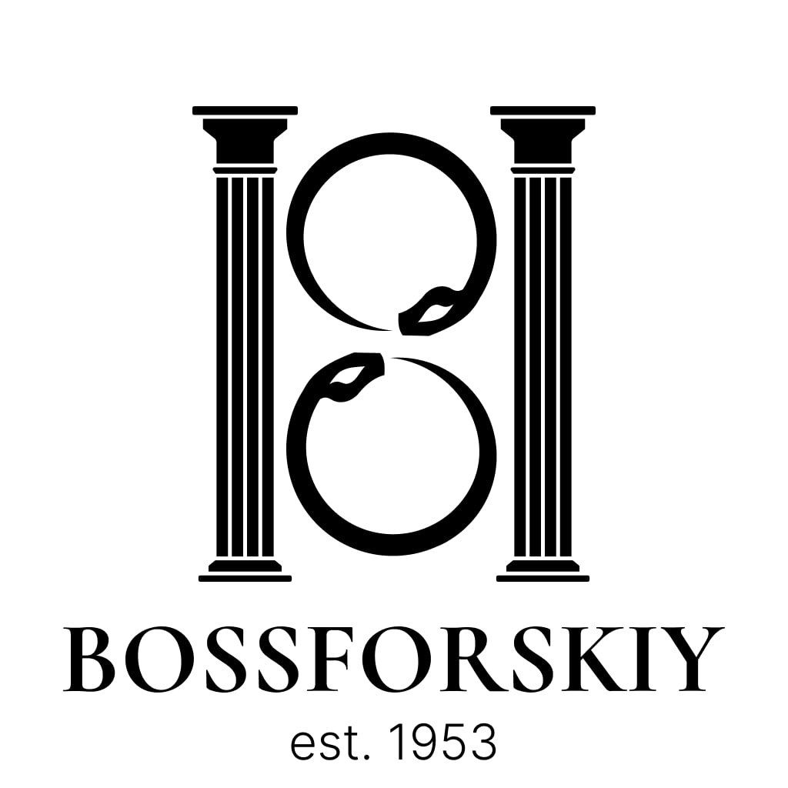

# 👑 BOSSFORSKIY Official Website

Welcome to the official monorepo for **BOSSFORSKIY Luxury Fashion** — a high-end cinematic fashion brand blending elegance, modernity, and glamour. This is the frontend and backend source code for the multilingual, SEO-optimized, and mobile-first web platform built using **Next.js**, **TypeScript**, **Tailwind CSS**, and more.

---

## 🌐 Live Website

👉 [https://bossforskiy.com](https://bossforskiy.com)

---

## 📸 Preview

---

## ✨ Features

- 🔤 Multilingual (EN / RU / TR) with `next-intl`
- ⚡ Lightning-fast Next.js 14 with App Router
- 💅 Beautiful UI with TailwindCSS & Framer Motion
- 🎥 Cinematic video backgrounds
- 🧠 AI-powered assistant integration (optional)
- 🧭 SEO-optimized with Open Graph, Twitter Cards, and Sitemap
- 🧼 Clean code, reusable components, and file-based routing
- 📱 Mobile-first responsive design
- 🔒 Accessibility (a11y) and dark mode ready
- 📂 Structured layout with reusable layouts and loaders

---

## 🛠️ Tech Stack

| Tech             | Purpose                        |
|------------------|--------------------------------|
| **Next.js 14**   | React framework with SSR & SSG |
| **TypeScript**   | Type-safe development          |
| **Tailwind CSS** | Utility-first CSS styling      |
| **Framer Motion**| Smooth animations              |
| **next-intl**    | Internationalization           |
| **Open Graph / Metadata** | SEO, social previews  |
| **PostgreSQL + Prisma** | (Optional: backend)     |

---

## 🗂️ Project Structure

